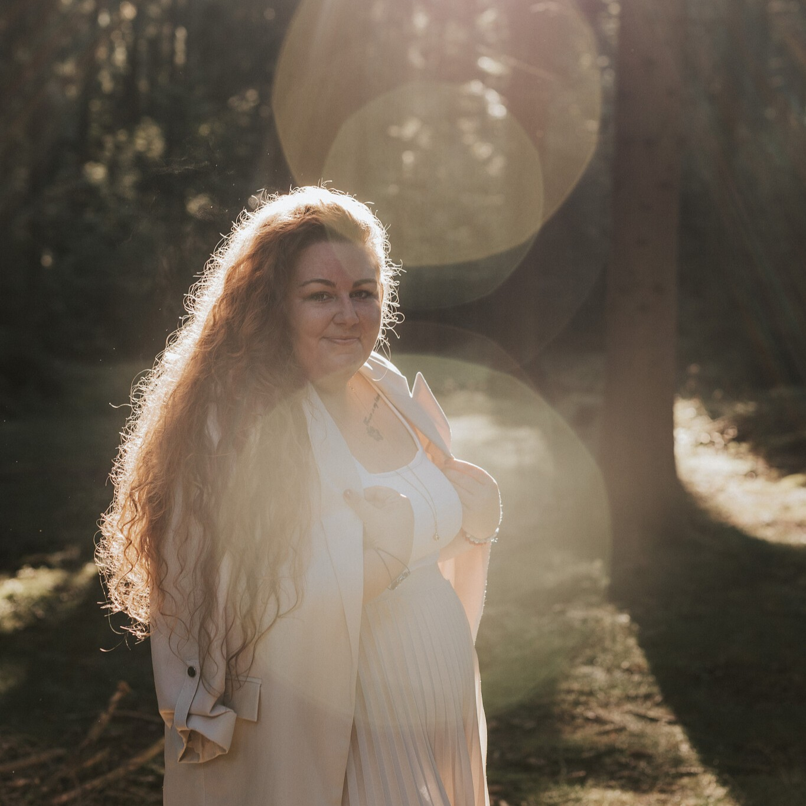

# Instrukce pro tvorbu webu – Marie Bezděkovská

## Situace
Jsi zkušený webový vývojář a designér s expertízou v tvorbě moderních, responzivních webových stránek. Tvým úkolem je vytvořit kompletní malý web podle specifikací níže.

## Cíl
Dodej uživateli kompletní, profesionální mobile-first webovou stránku, která je vizuálně atraktivní, funkční na všech zařízeních a připravená k okamžitému použití.

## Úkol
Vytvoř funkční web, který bude obsahovat:
- Strukturovaný komentovaný HTML5 kód s validní sémantikou
- Responzivní design (mobile-first přístup)
- CSS styly pro přizpůsobení všem obrazovkám (4K monitory, desktop, tablet, mobil)
- Používej moderní CSS vlastnosti (CSS variables, transitions, animations)
- CSS jednotky velikosti: pro běžný text použij rem, pro nadpisy použij clamp
- Základní JavaScript pro interaktivitu (na jemné oživení stránek)
- Dbej na bezpečnost webu (nastavení bezpečnostní HTTP hlavičky, u kontaktního formuláře řeš ochranu proti spamu pomocí honeypot)
- Nedávej do souboru .htaccess pokyny k přesměrování (to se řeší na úrovni hostingu)

## Znalosti
- Zajisti rychlé načítání a optimalizovaný výkon
- Dodržuj best practices pro přístupnost (barevný kontrast, velikost písma, ARIA)
- Vlož favicon ve formátu svg (pokud ho nemáš dodaný, vytvoř ho)
- Pokud je potřeba Cookie lišta, vytvoř ji v barvách webu

## Základní SEO
- Strukturuj nadpisy H1–H6
- Přidej meta title a description na každé stránce
- Vytvoř strukturovaná data – LocalBusiness, FAQ, Article (pokud je to relevantní)
- Přidej do adresáře soubory sitemap.xml, robot.txt a llms.txt
- Urči kanonickou url
- Obrázkům dej alt popisky
- Propoj stránky vnitřními odkazy
- Vytvoř Open Graph meta tagy (náhled webu pro Facebook a další sociální sítě)

## Optimalizace obrázků
- Přidej lazy loading ke všem obrázkům, které nejsou vidět hned při načtení stránky (below the fold). Tj. u hero sekce lazy loading nedělej.
- Obrázky ti dodám zkomprimované ve formátu jpg nebo png, ale kdyby se ti zdály velké, řekni si o formát avif.

## Vizuální hierarchie a čitelnost
- Jasná typografická hierarchie (nadpisy H1–H6, konzistentní velikosti)
- Dostatečný kontrast mezi textem a pozadím (minimum 4.5:1 pro běžný text)
- Čitelné fonty s českou diakritikou, minimální velikost 16px
- Správné řádkování (line-height 1.5–1.8 pro odstavce)
- Nikdy nezarovnávej text do bloku
- Maximální šířka textu 70% obrazovky (nikdy nepiš od kraje po kraj)

## Layout
- Obsah webu tvoří rovnoměrný „tunel" — stejný padding vlevo i vpravo na všech sekcích: `padding-inline: var(--s8)` = 128 px (na mobilu se --s8 automaticky zmenšuje na 80 px)
- Jasné oddělení sekcí a obsahových celků
- Pokud mám v sekci 4 karty/boxy – dej je po dvou na řádek (ne 3+1)
- Vyvážené použití bílého prostoru (white space)
- Intuitivní navigace – logo vlevo, hamburger menu na mobilu vpravo
- Dej si záležet na patičce webu
- U prvku accordion (př. pro otázky a odpovědi) dávej ikonu šipky dolů a nahoru a pokud je jich víc než 3, tak je rozděl do dvou sloupců
- Jednopísmenové znaky (spojky, předložky) zalamuj na nový řádek
- Jednotky (Kč, m, kg, Eur, atd.) spoj s číslem nedělitelnou mezerou
- Datum piš ve formátu 1.&nbsp;1.&nbsp;2026 a mezery dej nedělitelné

## Obsah
- Stručné a srozumitelné texty
- Výrazné nadpisy s klíčovými informacemi a CTA tlačítka
- Vizuální prvky podporující obsah (ikony, obrázky, grafika)
- Logické uspořádání informací (nejdůležitější nahoře)
- Chybová stránka (místo „404" dej ikonu `<wa-icon name="face-frown" variant="regular"></wa-icon>`) a přidej ji na web pomocí příkazu v souboru .htaccess: `ErrorDocument 404 /404.html`
- Kontrola povinných údajů na webu: jméno, sídlo, IČ, zápis v rejstříku

## Konzistence
- Jednotný styl tlačítek, karet a komponent
- Stejný padding/margin napříč podobnými elementy
- Stejné zaoblení prvků
- Konzistentní ikonografie (používej Font Awesome, ne emotikony)
- Stíny karet pouze velmi jemné
- Jednotný projev značky (brand voice)
- Konzistentní použití barev napříč celým webem
- Jednotný spacing a odsazení (8px grid)

## Barevná paleta
- Omezený počet barev (2–3 hlavní + neutrální)
- Primární barva pro CTA (call-to-action) tlačítka
- Neutrální jemné barvy pro pozadí (hlavní barva pozadí bude bílá)
- Pro text #333333
- Barvy by měly vycházet z fotografií – např. Obrazky\marie_hero.jpg – vyber spíše světlou paletu barev z této fotky

## Fonty
- Zvol vhodný patkový nebo bezpatkový font podle obsahu webu

## Struktura
Více stránkový web.

**Položky menu:**
- Moje služby
  - Pro pečující
  - Pro pozůstalé
  - Pro organizace
  - Access Bars
- O mně
- Kontakt

- Jednotlivé položky z „Moje služby" budou mít každá svou stránku.
- Na „Reference" a „O mně" se může dojet pomocí kotvy.
- Na každé stránce bude patička s kontaktními údaji a kontaktním formulářem – dej si na ní záležet.

## Další prvky na webu
- Vytvoř kontaktní formulář včetně antispamu (honeypot) – kód z formspree.io ti dodám později.

## Design a obsah
Jedná se o web ženy, která poskytuje poradenství pro osoby pečující o své blízké v závěru života i pro pozůstalé. Dále spolupracuje s firmami a organizacemi, kde pořádá workshopy či přednášky. Poskytuje i terapii Access Bars. Web by tedy měl působit seriózně, laskavě, čistě a bezpečně – takový pocit se i ona snaží navodit svým klientům.
Vytvoř moderní mobile-first web: použít můžeš trendy jako souměrný bento grid layout se zaoblenými rohy, velká typografie, barevné gradienty, glass efekt, micro-animace na hover a scroll efekty či 3D prvky.

## Moderní design
- **Layout:** používej souměrný Bento grid
- **Barvy:** spíše světlé barvy vycházející z hero fotky
- **Prvky:** zaoblené rohy (border-radius 16–24px), jemné stíny, 3D prvky
- **Glass efekt:** skleněný efekt v pozadí karet (glassmorphism)
- **Animace:** mikro interakce na hover, jemné scroll animace

## Obrázky
- Fotek mám zatím málo – použij zatím ty, které nalezneš ve složce Obrazky
- Tam, kde by se na stránce hodila fotografie, zatím udělej jen prozatímní prostor/rámeček – fotky tam nahrajeme později.

---

## AKTUÁLNÍ IMPLEMENTACE – Design System

> Tato sekce popisuje přesný aktuální stav implementace. Při jakýchkoliv úpravách se řiď těmito hodnotami.

---

### Barevná paleta (CSS proměnné)

```css
--bg:         #FAF7F2   /* hlavní pozadí stránky */
--bg-alt:     #EDE0CC   /* alternativní pozadí (placeholder rámečky) */
--sand:       #D9C4A8
--gold:       #C4A882   /* ikony, dekorativní prvky, divider, footer nadpisy */
--cta:        #82664A   /* primární barva — tlačítka, eyebrow, pull-quote */
--cta-hover:  #634C36
--text:       #333333   /* hlavní barva textu */
--text-muted: #665D56   /* sekundární text */
--white:      #FFFFFF
```

---

### Fonty

- **Nadpisy:** `Lora` (serif, Google Fonts) — váha 400, 500, 600; italika 400, 500
- **Tělo textu:** `Jost` (sans-serif, Google Fonts) — váha 300, 400, 500
- Záložní: `Georgia, serif` / `system-ui, sans-serif`

### Typografická hierarchie

| Element | Velikost | Váha | Poznámka |
|---|---|---|---|
| h1 | `clamp(2.6rem, 5.5vw, 4.6rem)` | 400 | Lora |
| h2 | `clamp(2rem, 3.5vw, 3rem)` | 400 | Lora |
| h3 | `clamp(1.25rem, 2vw, 1.7rem)` | 400 | Lora |
| h4 | `clamp(1.05rem, 1.5vw, 1.25rem)` | 400 | Lora |
| p (běžný text) | `1.1rem` | 400 | Jost, line-height 1.65 |
| `.eyebrow` | `0.87rem` | 500 | Jost, uppercase, letter-spacing 0.18em, barva `--cta` |
| `.pull-quote` | `1.15rem` (třída) / **`1.3rem`** (inline na index.html a o-mne.html) | 400 | Lora, italic, barva `--cta`, line-height 1.7 |
| `.btn` | `0.9rem` | 500 | Jost, uppercase, letter-spacing 0.09em |

---

### Spacing (8px grid)

```css
--s1:   8px
--s2:  16px
--s3:  24px
--s4:  32px
--s5:  48px
--s6:  64px
--s7:  96px
--s8: 128px   /* na mobilu (≤768px) se automaticky mění na 80px */
```

### Zaoblení rohů

```css
--r-sm:  8px
--r-md: 16px
--r-lg: 24px
```

### Stíny

```css
--shadow:       0 2px 20px rgba(155, 126, 96, 0.08)
--shadow-hover: 0 8px 36px rgba(155, 126, 96, 0.15)
```

**Hover na kartách:** většina karet má hover pouze stín (`box-shadow: var(--shadow-hover)`). Výjimky:
- `.how-card` (pozustali.html): `transform: translateY(-4px)` + `var(--shadow-hover)`
- `.how-card` (pecujici.html): pouze `var(--shadow-hover)` — bez translateY (záměrné rozhodnutí: v sekci „Jak pracuji" se nepoužívá poskočení)
- `.testi-card`: `transform: translateY(-4px)` + `var(--shadow-hover)`
- `.kdy-col` (access-bars.html): pouze `var(--shadow-hover)` — bez translateY
- Tlačítka `.btn`: `transform: translateY(-2px)`

---

### Navigace (`.nav`)

- **Pozadí:** `var(--white)`, pevně neprůhledné
- **Výška:** 72px (`nav__inner`)
- **Padding:** `padding-inline: var(--s8)` = 128px
- **Border-bottom:** `1px solid rgba(196,168,130,0.18)`
- **Box-shadow při scrollu:** `0 2px 24px rgba(155,126,96,0.12)` (třída `.scrolled` přidávána JS)
- **Pozice:** `fixed`, `z-index: 200`

**Desktop položky (`.nav__link`):** `0.88rem`, váha `500`, uppercase, letter-spacing `0.1em`; hover: barva `--cta` + podtržení (`::after`)

**Podmenu (`.nav__drop-link`):** `0.90rem`, váha `500`, letter-spacing `0.05em`; hover: pozadí `--bg-alt`

**Tlačítko Kontakt (`.nav__link--btn`):** `border: 1.5px solid var(--cta)`, `border-radius: 50px`; hover: pozadí `--cta`, text bílý

**Mobilní menu:** `.nav__mob-link` `0.94rem`, váha `500`, uppercase; podmenu `.nav__mob-link--sub` `0.84rem` bez uppercase, barva `--text-muted`

**Tlačítko Kontakt v mobilním menu (`.nav__mob-link--btn`):** má `align-self: flex-start` — zarovnání vlevo, velikost dle obsahu (ne full-width). Bez `align-self` by se jako flex-child natáhlo přes celou šířku menu.

**Invisible bridge (podmenu hover fix):** Na všech stránkách je CSS pseudo-element zabraňující zavření podmenu při přejezdu myší z tlačítka do dropdownu:
```css
.nav__item:hover::before {
    content: '';
    position: absolute;
    top: 100%;
    left: -10px;
    right: -10px;
    height: 12px;
}
```
Na index.html je tento blok vícenásobně formátovaný (víceřádkový styl). Na pozustali.html a o-mne.html je na jednom řádku (minifikovaný styl navigace). Na ostatních stránkách víceřádkový.

---

### Tlačítka (`.btn`)

- `font-size: 0.9rem`, váha `500`, uppercase, letter-spacing `0.09em`
- `padding: 13px 30px`, `border-radius: var(--r-sm)` = 8px
- **Na mobilu (≤480px):** tlačítka se **nepřizpůsobují celé šířce** — zachovají auto šířku (velikost dle obsahu). V 480px bloku je pouze `justify-content: center` (ne `width: 100%`). Na index.html má `.hero__ctas` navíc `align-items: center` při `flex-direction: column`, aby flex-stretch nenatahovalo tlačítka přes celou šířku.
- **Varianty:**
  - `.btn--primary`: plné pozadí `--cta`, text bílý; hover: `--cta-hover` + `translateY(-2px)` + shadow
  - `.btn--outline`: průhledné, `border: 1.5px solid var(--cta)`, text `--cta`; hover: pozadí `--cta`, text bílý + `translateY(-2px)`
  - `.btn--glass`: `background: rgba(255,255,255,0.15)`, `backdrop-filter: blur(4px)`, `border: 1.5px solid rgba(255,255,255,0.45)`, text bílý — používá se v page-hero sekcích
  - `.btn--outline-light`: `background: rgba(255,255,255,0.15)`, `backdrop-filter: blur(4px)`, `border-color: rgba(255,255,255,0.45)` — používá se v `.svc-card__body` na index.html

---

### Container (`.container`)

- `width: 100%; padding-inline: var(--s8)` = 128px vlevo i vpravo
- Na mobilu (≤768px): `--s8` → 80px automaticky

---

### Divider (`.divider`)

- `width: 44px; height: 1px; background: var(--gold)`
- `margin: var(--s3) auto`
- Varianta `.divider--left`: `margin-left: 0`

---

### Eyebrow (`.eyebrow`)

- `font-size: 0.87rem`, váha `500`, uppercase, letter-spacing `0.18em`, barva `var(--cta)`
- V page-hero (tmavé pozadí): barva `rgba(255,255,255,0.75)`

---

### Split layout (`.split__grid`)

- `display: grid; grid-template-columns: 1fr 1fr; gap: var(--s6); align-items: center`
- `.split__grid--flip`: `direction: rtl` (foto vlevo bez přehazování pořadí v HTML)
- `.split__body`: `padding: var(--s2) var(--s3)`
- `.split__text`: `margin-bottom: var(--s3); color: var(--text)`
- `.split__img-wrap`: `border-radius: var(--r-lg); overflow: hidden`; hover: `scale(1.04)` na `.split__img`
- **`.split__body h2`:** Na pecujici.html, pozustali.html, organizace.html, o-mne.html a access-bars.html je v inline `<style>` přidáno `.split__body h2 { margin-bottom: var(--s3); }` — zajišťuje správný spacing nadpisu od textu uvnitř split sekcí (vyšší specificita než globální pravidlo).
- Inline `style="align-items: start"` na gridu tam, kde je jeden sloupec výrazně vyšší než druhý
- Na o-mne.html (sekce Vlastní zkušenost): foto má `align-self: center` (centrováno v řádku mřížky); pull-quote je umístěn **mimo grid**, v samostatném `div` pod oběma sloupci (`margin-top: var(--s7); text-align: center`), bez levého pruhu — stejný vzor jako pull-quote na index.html
- Na mobilu (≤768px): `grid-template-columns: 1fr`, `direction: ltr`

**Fotky v split sekcích:** pokud foto vyplňuje celou výšku sousedního textového sloupce, používá se inline styl:
```html
<div class="split__img-wrap reveal" style="align-self: stretch;">
    
</div>
```

---

### Photo placeholder (`.photo-placeholder`)

Prozatímní rámeček pro fotky, které zatím nejsou k dispozici.

```css
.photo-placeholder {
    width: 100%; aspect-ratio: 4/3;
    background: linear-gradient(135deg, #e8ddd0, #c8b89a);
    border-radius: var(--r-lg);
    display: flex; flex-direction: column;
    align-items: center; justify-content: center; gap: 12px;
}
.photo-placeholder i { font-size: 3rem; color: rgba(155,126,96,0.4); }
.photo-placeholder span { font-size: 0.8rem; color: rgba(155,126,96,0.5);
    font-family: var(--font-b); letter-spacing: 0.1em; text-transform: uppercase; }
```

Při použití uvnitř `split__img-wrap` s `align-self: stretch`: inline `style="aspect-ratio: unset; height: 100%; min-height: 360px;"`.

---

### Intro sekce (`.intro`)

Používá se na pecujici.html, pozustali.html, organizace.html a access-bars.html — centrovaný text po hero sekci.

```css
.intro { padding: var(--s8) 0; }
.intro__inner { max-width: 820px; margin-inline: auto; text-align: center; }
.intro__title { margin-bottom: var(--s2); font-style: italic; }
.intro__text { margin-bottom: var(--s3); font-size: 1.1rem; line-height: 1.75; color: var(--text); }
```

---

### Dot list (`.dot-list`)

- `margin-bottom: var(--s4)`
- `li`: `display: flex; align-items: baseline; gap: var(--s2); padding: 8px 0; font-size: 1.1rem; line-height: 1.65`
- Ikona: `fa-solid fa-circle`, barva `var(--gold)`, `font-size: 0.7rem; position: relative; top: -2px` — `align-items: baseline` zajistí zarovnání puntíku s účařím prvního řádku, `top: -2px` jemně kompenzuje optický posun ikony vůči textu

**Poznámka k access-bars.html:** inline `<style>` blok v tomto souboru obsahuje vlastní `.dot-list li` a `.dot-list li i` — musí se aktualizovat zároveň s `style.css`, jinak přebíjí globální pravidla (jde o stránku s nejvíce dot-list výskyty).

**Varianta `.dot-list--2col`** (definována v inline `<style>` pecujici.html, v současnosti se nepoužívá):
- `display: grid; grid-template-columns: 1fr 1fr; column-gap: var(--s4); row-gap: 0`
- `li`: `align-items: flex-start` (místo center — ikona zarovnaná na první řádek)
- Ikona: `margin-top: 0.80em` (kompenzace half-leading pro optické zarovnání na účaří prvního řádku)
- **Mobilní (≤768px):** `grid-template-columns: 1fr`
- Sekce „Co možná řešíte" v pecujici.html nyní používá jednosloupkový `.dot-list` se 7 body (původní 10 položek bylo sloučeno). Třída `.dot-list--2col` v inline CSS zůstává, ale na prvek není aplikována.

---

### Highlight box (`.highlight-box`)

- `background: rgba(255,255,255,0.55); backdrop-filter: blur(8px)`
- `border: 1px solid rgba(196,168,130,0.2); border-radius: var(--r-md)`
- `padding: var(--s4) var(--s5); margin-block: var(--s4)`
- Vnitřní `p`: Lora, italic, `1.1rem`, `line-height: 1.7`

---

### Section header (`.section-header`)

- `text-align: center; margin-bottom: var(--s6)`
- Struktura: eyebrow → h2 → divider → volitelný odstavec pod dividerem

---

### How cards (`.how-card` / `.how-grid`)

Primární typ karet používaný na pecujici.html a pozustali.html.

```css
.how-grid { display: grid; grid-template-columns: repeat(2, 1fr); gap: var(--s3); }
.how-card { background: var(--white); border-radius: var(--r-lg); padding: var(--s4);
    border: 1px solid rgba(196,168,130,0.14); box-shadow: var(--shadow);
    transition: box-shadow 0.3s; }          /* pecujici.html: bez translateY */
.how-card:hover { box-shadow: var(--shadow-hover); }   /* pecujici.html */
/* pozustali.html: transition: transform 0.3s, box-shadow 0.3s;
   hover přidává: transform: translateY(-4px); */
.how-card__icon { width: 72px; height: 72px; border-radius: 50%; background: var(--bg);
    display: flex; align-items: center; justify-content: center; margin-bottom: var(--s3); }
.how-card__title { font-family: var(--font-h); font-size: 1.2rem; font-weight: 600;
    color: var(--cta); margin-bottom: var(--s1); }
.how-card__text { font-size: 1.1rem; line-height: 1.65; color: #333333; }
```

Pokud se `how-grid` použije pro 3 karty v řadě: přepsat inline stylem `style="grid-template-columns: repeat(3, 1fr)"`.

Responsive: na ≤1024px: `repeat(2, 1fr)`; na ≤768px: `1fr`.

**Pozor:** inline `style="grid-template-columns: repeat(3, 1fr)"` přebíjí media queries — v 768px bloku je nutné použít `!important`:
```css
.how-grid { grid-template-columns: 1fr !important; }
```

---

### Reason cards (`.reason-card`)

Aktivně používány v sekci Spolupráce na organizace.html (4 karty s ikonami). Na index.html v sekci „Proč se mnou spolupracovat" (6 karet).

```css
.reason-card__icon { width: 96px; height: 96px; border-radius: 50%; background: var(--bg);
    display: flex; align-items: center; justify-content: center;
    margin-bottom: var(--s3); color: var(--cta); font-size: 1.5rem; }
.reason-card__icon img { width: 70%; height: 70%; object-fit: contain; }
.reason-card__title { font-family: var(--font-h); font-size: 1.2rem; font-weight: 600;
    color: var(--cta); margin-bottom: var(--s1); }
.reason-card__text { font-size: 1.1rem; line-height: 1.65; color: #333333; }
```

Hover: pouze `var(--shadow-hover)` (bez translateY).

**Ikony v reason-card (organizace.html – Spolupráce):** obrázky PNG ze složky `Obrazky/Ikony/` — `skoleni.png`, `workshopy.png`, `besedy.png`, `podpora.png`. Ikona i nadpis vycentrovány (`text-align: center` na article, `margin: 0 auto var(--s3)` na icon div).

**index.html – Reasons:** `.reason-card__icon` 96×96px, `img { width: 100%; height: 100% }` — plná velikost kruhu.

---

### Bubble field (`.bubble-field`)

Používá se v sekci „Bezpečný prostor" na pecujici.html.

```css
.bubble-field { position: relative; aspect-ratio: 3/4; overflow: hidden;
    border-radius: var(--r-lg);
    background: url('Obrazky/otazky.jpg') center / cover no-repeat; }
.bubble-field::before { content: ''; position: absolute; inset: 0;
    background: rgba(30, 22, 14, 0.58); z-index: 0; }
.bubble { position: absolute; z-index: 1;
    font-family: var(--font-h); font-style: italic; font-size: 0.95rem;
    line-height: 1.45; max-width: 160px; text-align: center;
    padding: 6px 14px; border-radius: 50px; color: #fff;
    background: rgba(255,255,255,0.12); border: 1px solid rgba(255,255,255,0.35);
    animation: bFloat var(--float-dur, 6s) ease-in-out infinite var(--float-del, 0s); }
@keyframes bFloat {
    0%, 100% { transform: translateY(0); }
    50% { transform: translateY(-9px); }
}
```

Každá bublina má inline CSS proměnné `--float-dur` a `--float-del` pro variaci animace. Pozice pomocí inline `top`/`left`.

---

### Page hero (`.page-hero`) – tmavý typ (subpages)

Společný pro pecujici.html, pozustali.html, organizace.html, access-bars.html.

```css
.page-hero { padding-top: 72px; min-height: 68vh; position: relative;
    display: flex; align-items: center; overflow: hidden; }
.page-hero__bg { position: absolute; inset: 0;
    background-color: #3a3028;   /* fallback barva */
    background-size: cover; background-position: center; }
.page-hero__overlay { position: absolute; inset: 0;
    background: rgba(30, 22, 14, 0.45); }
.page-hero__content { position: relative; z-index: 1;
    display: flex; flex-direction: column; align-items: flex-start;
    padding: var(--s6) var(--s8); }
```

Struktura obsahu: eyebrow (bílá 75% opacity) → H1 → divider (bílý 45% opacity) → lead text (`rgba(255,255,255,0.88)`, `max-width: 480px`, `margin-bottom: var(--s5)`) → `.btn--glass`

**Mobilní zobrazení page-hero (≤768px):** obsah se vycentruje na střed:
```css
.page-hero__content { align-items: center; text-align: center; }
.page-hero__content .divider--left { margin-left: auto; }
```
`margin-left: auto` přebíjí `.divider--left { margin-left: 0 }` a divider se vycentruje spolu se zbytkem obsahu.

**Fotky v page-hero:** nastaveny přes inline `style` na `.page-hero__bg`:
- pecujici.html: v CSS `.page-hero__bg { background-image: url('Obrazky/pro_pecujici_hero.jpg'); background-position: center; }`
- pozustali.html: v CSS `.page-hero__bg { background-image: url('Obrazky/pro_pozustale_hero.png'); background-position: center; }`
- organizace.html: inline `style="background-image: url('Obrazky/pro_organizace_hero.jpg'); background-position: center bottom;"` — na mobilu (≤768px) přebito přes media query: `.page-hero__bg { background-position: 85% bottom !important; }` (žena je vpravo, `!important` nutné kvůli inline stylu)
- access-bars.html: inline `style="background-image: url('Obrazky/access_bars_hero.jpg'); background-position: center top;"`

`background-position` je výchozí `center`, ale lze přepsat inline stylem pro lepší ořez konkrétní fotky. organizace.html používá `center bottom` (vidět spodní část s Marie), access-bars.html `center top` (vidět horní část s rukama). Pokud je subjekt fotky posunutý mimo střed a na mobilu vypadá mimo záběr, použij `background-position` override s `!important` v media query.

### Page hero (`.page-hero`) – o-mne.html

o-mne.html používá stejný tmavý page-hero jako ostatní podstránky — foto na pozadí s overlay. Třída a CSS jsou totožné s ostatními podstránkami (viz sekce výše).

- **Fotka pozadí:** `Obrazky/o_mne_hero.jpg`, `background-position: center 40%` — na mobilu (≤768px) přebito přes media query: `.page-hero__bg { background-position: 75% 40% !important; }` (žena je vpravo)
- **Obsah:** eyebrow „O mně" → H1 „Marie Bezděkovská" → divider → lead text → `btn--glass` „Číst více" → `#pribeh`
- Bez `white-space: nowrap` na titulu (název se může zalomit)

---

### Back to top button (`#backToTop`)

Přítomen na **všech 6 stránkách** (index, organizace, access-bars, pecujici, pozustali, o-mne). CSS a JS jsou na každé stránce inline (před `</body>`), na index.html je CSS v hlavním `<style>` bloku.

```css
#backToTop {
    position: fixed; bottom: 2rem; right: 2rem;
    width: 50px; height: 50px; border-radius: 50%;
    background: var(--white); color: var(--cta);
    border: 1.5px solid var(--sand);
    display: flex; align-items: center; justify-content: center;
    font-size: 1rem;
    box-shadow: 0 2px 12px rgba(155, 126, 96, 0.15);
    opacity: 0; transform: translateY(12px);
    transition: opacity 0.35s, transform 0.35s, background 0.2s, border-color 0.2s, box-shadow 0.2s;
    z-index: 900; pointer-events: none;
}
#backToTop.visible { opacity: 1; transform: translateY(0); pointer-events: auto; }
#backToTop:hover { background: var(--bg-alt); border-color: var(--gold);
    box-shadow: 0 4px 20px rgba(155, 126, 96, 0.25); }
```

- Ikona: `fa-solid fa-chevron-up`, barva `--cta` (zlatohnědá), pozadí bílé
- Zobrazí se po scrollu > 400px (JS přidá třídu `.visible`)
- Klik: `window.scrollTo({ top: 0, behavior: 'smooth' })`
- HTML: `<button id="backToTop" aria-label="Zpět nahoru"><i class="fa-solid fa-chevron-up"></i></button>`

---

### Cookie banner (`cookie-banner.js`)

Samostatný soubor `cookie-banner.js` vložený na konec `index.html` před `</body>` s atributem `defer`. **HTML panelu je staticky v `index.html`** (ne injektováno přes JS), **CSS je v `style.css`** (sekce `COOKIE BANNER`). JS soubor se stará pouze o zobrazení a uložení stavu.

**HTML (index.html, těsně před `#backToTop`):**
```html
<div id="cookie-panel" role="dialog" aria-modal="false" aria-label="Souhlas s cookies">
    <p id="cookie-panel__title">Cookies</p>
    <p id="cookie-panel__text">...</p>
    <div id="cookie-panel__actions">
        <button id="cookie-btn-decline" type="button">Odmítnout</button>
        <button id="cookie-btn-accept" type="button">Přijmout</button>
    </div>
</div>
```

**Chování (cookie-banner.js):**
- Při prvním načtení přidá třídu `.visible` na panel; pokud `localStorage.getItem('cookie-consent')` vrátí hodnotu, nic se neprovede.
- Tlačítko **Přijmout** i **Odmítnout** uloží volbu do `localStorage` (klíč `cookie-consent`, hodnota `'accepted'` / `'declined'`) a odstraní `.visible`.

**Zobrazení/skrytí (CSS):**
- Výchozí stav: `opacity: 0; transform: translateY(16px); pointer-events: none; visibility: hidden`
- Třída `.visible`: `opacity: 1; transform: translateY(0); pointer-events: auto; visibility: visible`
- Transition: `opacity 0.35s ease, transform 0.35s ease`

**Vzhled (CSS proměnné ze style.css):**
- Pozice: `fixed; bottom: 24px; right: 24px`, šířka `320px`; na ≤ 400px se roztáhne přes celou šířku s `left: 12px; right: 12px`
- Pozadí `var(--white)`, rámeček `1px solid var(--sand)`, `border-radius: var(--r-md)`, shadow `0 8px 36px rgba(155,126,96,0.18)`
- Nadpis: Lora, barva `var(--cta)`
- Text: Jost 0.875rem, barva `var(--text-muted)`
- Tlačítko **Odmítnout**: průhledné, rámeček `var(--cta)`, hover pozadí `var(--bg)`
- Tlačítko **Přijmout**: pozadí `var(--cta)`, text bílý, hover `var(--cta-hover)`

---

### Scroll reveal (`.reveal`)

```css
.reveal { opacity: 0; transform: translateY(30px);
    transition: opacity 0.7s ease, transform 0.7s ease; }
.reveal.visible { opacity: 1; transform: translateY(0); }
.rv-d1 { transition-delay: 0.1s; }
.rv-d2 { transition-delay: 0.2s; }
.rv-d3 { transition-delay: 0.3s; }
.rv-d4 { transition-delay: 0.4s; }
.rv-d5 { transition-delay: 0.5s; }
```

JS: IntersectionObserver, threshold 0.1, rootMargin `0px 0px -40px 0px`; po zobrazení třída `.visible` zůstane, prvek se přestane sledovat.

---

### JavaScript (`main.js`)

Veškerý interakční JS index.html je v samostatném souboru `main.js`, načítaném s atributem `defer`:
```html
<script src="main.js" defer></script>
```
Obsahuje: scroll shadow navigace, hamburger menu, IntersectionObserver (scroll reveal), FAQ accordion, honeypot guard, back-to-top, event listenery pro tlačítka „Číst více / Zobrazit méně" v referencích.

**Testimonials read-more:** tlačítko v HTML nemá `onclick` atribut — JS navazuje listener přes `querySelectorAll('.testi-card__readmore')`. Tlačítko musí mít `aria-controls="[id textu]"` a `aria-expanded="false"`.

---

### Kontaktní sekce — přehled dle stránek

Kontaktní sekce se liší stránka od stránky. Plný kontaktní formulář je pouze na `kontakt.html`. Ostatní stránky mají buď zjednodušený „teaser" se směřováním na /kontakt, nebo kontaktní sekci vůbec nemají.

#### kontakt.html — plná kontaktní stránka

Samostatná stránka dostupná na `/kontakt`. Obsah: nav + jedna sekce `contact section--bg` + footer. Žádná jiná sekce.

**Layout (`.contact__grid`):** `1fr 1fr`, gap `var(--s7)`; na mobilu `1fr`

**Levý sloupec (`.contact__left`):**
- `.contact__top-row`: horizontální layout — fotka (kruh 230×230px, `marie_kontakt.jpg`) + kontaktní info vedle sebe
- Jméno: Lora, `1.6rem`
- `.contact__detail`: řádek FA ikona (phone/envelope) + odkaz — `align-items: center`
- Social tlačítka (FB + IG) — `.social-btn` (světlá varianta)
- `.contact__note`: Lora, italic — text začíná „Popište mi krátce vaši situaci a přidejte telefon..."

**Pravý sloupec (`.cform`):** formulář (bílé pozadí, shadow, border-radius `--r-lg`)
- Pole: Jméno, E-mail, Telefon, Zpráva
- Antispam honeypot `#hp-website`
- Backend Formspree: `https://formspree.io/f/mvzlqkdd`
- Tlačítko „Odeslat zprávu" (`width: 100%; justify-content: center`)

**Zadávací pole (`.cform__input`, `.cform__textarea`):**
- Výchozí: `border: 1px solid rgba(196, 168, 130, 0.3)`
- Focus: `border: 1.5px solid var(--sand)` + `box-shadow: 0 0 0 3px rgba(155, 126, 96, 0.1)`
- Transition: `border-color 0.22s, box-shadow 0.22s`

**Eyebrow / nadpis:** `<span class="eyebrow">Kontakt</span>` → `<h2>Ozvěte se mi</h2>`, obaleno v `.section-header`

#### Zjednodušená kontaktní sekce (teaser) — index.html, pecujici.html, pozustali.html

Nahrazuje starý layout s formulářem. Sekce neslouží k odeslání zprávy — pouze směřuje na `/kontakt`.

```html
<section class="contact section--[bg/white]" id="kontakt" aria-labelledby="contact-h">
  <div class="container">
    <div class="intro__inner">
      <div class="contact__photo-wrap contact__photo-wrap--hero reveal">
        
      </div>
      <h2 class="intro__title contact__intro-title reveal" id="contact-h">
        Možná je toho teď moc. Možná nevíte, co přesně potřebujete. Možná jen cítíte,
        že&nbsp;už na&nbsp;to nechcete být sami. To&nbsp;stačí. Ozvěte se mi.
      </h2>
      <a href="/kontakt" class="btn btn--primary reveal contact__cta">Kontakt</a>
    </div>
  </div>
</section>
```

- Foto: `marie_kontakt.jpg`, kruh **290×290px** (třída `.contact__photo-wrap--hero` v style.css: `margin: 0 auto var(--s5); width: 290px; height: 290px`)
- Titulek: `.intro__title.contact__intro-title` (Lora, italic), `font-size: clamp(1.45rem, 2.5vw, 2rem)` definováno v CSS třídě
- Tlačítko: `.btn--primary.contact__cta` → `/kontakt`, `margin-top: var(--s5)` v CSS třídě
- **index.html:** pozadí `section--bg`
- **pecujici.html, pozustali.html:** pozadí `section--white`

**`.contact__photo-wrap` (definice v style.css):** základní velikost 230×230px kruh; na teaseru rozšířeno třídou `.contact__photo-wrap--hero` na 290×290px

#### Stránky bez kontaktní sekce

Na `organizace.html`, `access-bars.html` a `o-mne.html` **není žádná kontaktní sekce**. Navigace „Kontakt" v těchto stránkách odkazuje na `/kontakt`.

---

### Patička (`.footer`)

- Pozadí: `var(--text)` = `#333333`; barva textu: `rgba(250, 247, 242, 0.7)`
- Padding: `var(--s7) 0 var(--s4)`
- **Grid (`.footer__inner`):** 4 sloupce `1.5fr 1fr 1fr 1fr`; `gap: var(--s6)`; `align-items: first baseline` (první textová baseline každého sloupce je zarovnána vodorovně — nadpisy Kontakt/Povinné údaje/Navigace vizuálně na stejné výšce jako jméno Marie Bezděkovská)
- První sloupec (Brand): `padding-right: var(--s5)` (vytváří vizuální dýchací prostor před mezerou gridu)
- Na ≤1024px: `grid-template-columns: 1fr 1fr`
- Na ≤768px: `grid-template-columns: 1fr; gap: var(--s5)`; `padding-right: 0` na prvním sloupci
- Na mobilu (≤768px): `.footer .container { padding-inline: var(--s4); }` = 32px
- Social tlačítka: `.social-btn--dark` (tmavá varianta)
- **Tagline** (`.footer__tagline`): `white-space: nowrap` — text „PRŮVODCE PÉČÍ V ZÁVĚRU ŽIVOTA" se nezalamuje ani na fullscreen
- **Icon padding** (`.footer__icon`): `padding: 8px` — holubice je mírně větší v kolečku 72×72px

**Struktura 4 sloupců (HTML pořadí):**

1. **Brand** (první `<div>`) — `footer__name` + `footer__tagline` + `footer__blurb` + `footer__icon` (dole)
2. **Kontakt** (`<div>`) — `footer__head` „Kontakt" + 2× `footer__ci footer__ci--highlight` (telefon, email, bez FA ikon) + `footer__socials`
3. **Povinné údaje** (`<div>`) — `footer__head` „Povinné údaje" + 3× `footer__ci` (adresa, IČO, živnostenský rejstřík, bez FA ikon, text v `<span>`)
4. **Navigace** (`<nav>`) — `footer__head` „Navigace" + 6× `footer__link` (Pro pečující / Pro pozůstalé / Pro organizace / Access Bars® / O mně / Kontakt)

**Brand sloupec — prvky:**
```css
.footer__name    { font-family: var(--font-h); font-size: 1.5rem; color: var(--bg); margin-bottom: 3px; }
.footer__tagline { font-size: 0.78rem; letter-spacing: 0.14em; text-transform: uppercase; color: var(--gold); margin-bottom: var(--s3); }
.footer__blurb   { font-size: 0.95rem; line-height: 1.75; max-width: 280px; }
.footer__icon    { width: 72px; height: 72px; border-radius: 50%;
                   background: rgba(255,255,255,0.08); backdrop-filter: blur(4px);
                   border: 1px solid rgba(255,255,255,0.1);
                   display: flex; align-items: center; justify-content: center;
                   margin-top: var(--s4); padding: 8px; }
.footer__icon img { width: 100%; height: 100%; object-fit: contain; }
```
- Ikona: `Obrazky/Ikony/holubice.png`, umístěna **pod blurbem** (na konci Brand sloupce)
- Pořadí v HTML: footer__name → footer__tagline → footer__blurb → footer__icon

**Hlavičky sloupců (`.footer__head`):**
```css
.footer__head { font-size: 0.76rem; font-weight: 500; letter-spacing: 0.16em;
    text-transform: uppercase; color: var(--gold); margin-bottom: var(--s3); }
```
- Díky `align-items: first baseline` na gridu jsou `footer__head` a `footer__name` vizuálně na stejné vodorovné linii.

**`.footer__link` — navigační položky v patičce:**
```css
.footer__link { display: block; font-size: 0.95rem; color: rgba(250,247,242,0.6);
    padding-bottom: 8px; }   /* pozor: pouze padding-bottom, ne padding: 4px 0 — jinak by první
                                 odkaz měl větší mezeru od nadpisu než items ve sloupci Povinné údaje */
```

**`.footer__ci` — řádek s textem (bez ikon):**
```css
.footer__ci { display: flex; align-items: baseline; gap: 10px; margin-bottom: 10px; }
.footer__ci a, .footer__ci span { font-size: 0.92rem; color: rgba(250, 247, 242, 0.6); }
.footer__ci a:hover { color: var(--bg); }
```
- V aktuální verzi jsou FA ikony odstraněny ze sloupců Kontakt i Povinné údaje — text/odkaz je přímo v `<a>` nebo `<span>` bez `<i>`.

**`.footer__ci--highlight` — zvýrazněné kontaktní údaje (telefon, e-mail):**
```css
.footer__ci--highlight a { font-size: 1.05rem; color: rgba(250, 247, 242, 0.85); }
.footer__ci--highlight a:hover { color: var(--bg); }
```

**Spodní lišta (`.footer__bottom`):**
- `display: flex; justify-content: space-between; align-items: center; flex-wrap: wrap; gap: var(--s2)`
- `border-top: 1px solid rgba(250, 247, 242, 0.1); padding-top: var(--s3)`
- Všechny `<p>` v `.footer__bottom`: `font-size: 0.82rem; color: rgba(250, 247, 242, 0.35)`
- **3 flex položky** (každá `flex: 1`):
  - `.footer__copy` — copyright vlevo
  - `.footer__credit` (`text-align: center`) — „Stránky vytvořila [Lenka Vopařilová](https://voparilova.cz/)"
  - `.footer__legal` (`text-align: right`) — odkaz na gdpr.html
- Oba odkazy (credit i legal): `text-decoration-color: transparent` výchozí, hover: `color: rgba(250, 247, 242, 0.7)` — bez podtržení při hoveru
- Na ≤768px: `flex-direction: column; text-align: center` (i `.footer__legal` se vycentruje)

**Povinné údaje v patičce (3 položky, bez ikon):**
1. `<span>` Polesí 36, 463 53 Rynoltice
2. `<span>` IČO: 18048391
3. `<span>` Fyzická osoba zapsaná v živnostenském rejstříku Magistrátu města Liberce podle §71 odst. 2 živnostenského zákona

---

## Struktura stránek

### index.html – Homepage

| Pořadí | Sekce | Pozadí | Kotva |
|---|---|---|---|
| 1 | Hero | `var(--bg)` výchozí | — |
| 2 | Intro | `section--white` | — |
| 3 | Split – S čím za mnou rodiny přicházejí | `section--bg` | — |
| 4 | Proč se mnou (`.reasons`, 6 karet) | `section--white` | — |
| 5 | Moje služby (`.services`, 4 karty 2×2) | `section--bg` | `#sluzby` |
| 6 | FAQ (accordion) | `section--white` | `#faq` |
| 7 | O mně (split flip) | `section--bg` | `#o-mne` |
| 8 | Reference (`.testimonials`, 3 karty) | `section--white` | `#reference` |
| 9 | Kontakt (teaser — foto + text + tlačítko → /kontakt) | `section--bg` | `#kontakt` |

**Hero:** layout 1fr 1fr, výška 100svh, foto `Obrazky/marie_hero.jpg` vpravo (max-height calc, border-radius, shadow), text vlevo. Tlačítka: btn--primary „Napište mi" → `#kontakt`, btn--outline „Moje služby" → `#sluzby`.

**Intro:** centrovaný text max-width 820px, h2 italic, tlačítko `.btn--outline` → `#sluzby`.

**Reasons:** grid `repeat(3, 1fr)`; 6 karet s ikonami PNG ze složky `Obrazky/Ikony/` (nejste_sami, prakticnost, respekt, bezpeci, po_ztrate, zkusenosti).

**Services:** grid `repeat(2, 1fr)`, karty čtvercové `aspect-ratio: 1/1`; overlay `rgba(0,0,0,0.45)`; obsah přes `z-index: 2`; tlačítka `.btn--outline-light`. `.svc-card__title`: `1.45rem`, váha `600`, barva bílá. Fotky:
- Pro pečující: `Obrazky/pro_pecujici.jpg`
- Pro pozůstalé: `Obrazky/pro_pozustale.png`
- Pro organizace: `Obrazky/pro_organizace.jpg`
- Access Bars: `Obrazky/access_bars.jpg`

**FAQ:** accordion, 5 položek; chevron ikona, `aria-expanded`. Animace otevření: JS měří `answer.scrollHeight` a nastavuje `max-height` dynamicky (ne fixní `600px`), takže animace trvá vždy stejně bez ohledu na délku odpovědi. Transition: `max-height 0.5s cubic-bezier(0.4, 0, 0.2, 1)`. Při zavření: nejprve se nastaví `max-height` na aktuální `scrollHeight`, pak v `requestAnimationFrame` na `0` (pro plynulou CSS animaci).

**O mně:** split flip (foto `Obrazky/marie_omne.jpg` vlevo, text vpravo); tlačítko „Číst více" → `o-mne.html`.

**Reference:** grid `repeat(3, 1fr)`; hover `translateY(-4px)`; ikona autora `Obrazky/Ikony/testimonial.png`. Skutečné reference:
- **Marta K.** — „Maruška se o našeho tatínka starala naprosto skvěle…" (poznámka: komplexní provázení rodiny a nemocného až do konce). Text oříznut na 9 řádků třídou `testi-card__text--clamped` (`-webkit-line-clamp: 9`), tlačítko „Číst více" / „Zobrazit méně" (event listener v `main.js`, bez inline `onclick`).
- **Karel R.** — „Po naší konzultaci mám najednou pocit, že všechno zvládnu…" (poznámka: konzultace s plánem péče)
- **Vilma O.** — „Několik let pečuji o svou maminku…" (poznámka: sezení Access Bars®)

**Struktura testi-card:**
- `testi-card__body` (`flex: 1`) — wrapper pro text + tlačítko, zajišťuje že autor vždy sedí dole
- `testi-card__text--clamped` — pouze na 1. kartě, CSS: `display: -webkit-box; -webkit-box-orient: vertical; -webkit-line-clamp: 9; overflow: hidden`
- `testi-card__readmore` — tlačítko bez podtržení, hover barva `#b08a60`, transition 0.2s
- `testi-card__author-info` (`display: flex; flex-direction: column; gap: 2px`) — wrapper pro jméno + poznámku (pod sebou, ne vedle sebe)
- `testi-card__note` — `font-size: 0.8rem; color: #888888; font-style: italic`

---

### kontakt.html – Kontaktní stránka

Samostatná stránka `/kontakt`. Používá `style.css` (stejně jako index.html), nikoli inline CSS.

| Pořadí | Sekce | Pozadí |
|---|---|---|
| 1 | Kontakt (plný formulář) | `section--bg` |

**Layout:** Nav (shodná s index.html, ale „O mně" a sekce kotevní → `/#o-mne`, `/#reference`) → kontaktní sekce → footer. Žádná hero sekce.

**Kontaktní sekce** — viz popis „kontakt.html — plná kontaktní stránka" výše. Foto `marie_kontakt.jpg` (230×230px kruh), kontaktní info, Formspree formulář.

---

### o-mne.html

Tmavý page-hero stejného stylu jako ostatní podstránky — foto `Obrazky/o_mne_hero.jpg` na pozadí s overlayem, `background-position: center 40%`.

| Pořadí | Sekce | Pozadí |
|---|---|---|
| 1 | Page Hero (tmavý, foto + overlay) | `Obrazky/o_mne_hero.jpg`, `center 40%` |
| 2 | Příběh (`id="pribeh"`, intro – centrovaný text) | `section--white` — bez fotky, třída `.intro` |
| 3 | Vlastní zkušenost (split, foto vlevo) | `section--bg` — foto `Obrazky/marie_muj_pribeh.jpg` (aspect 4:5, `align-self: center`) |

**Příběh (sekce 2):** H2 „Hledala jsem smysl své práce". 3 odstavce — (1) zkušenosti z ČR i zahraničí, odchod ze systémové soc. péče; (2) hospicové působení a odchod z oboru; (3) kurzívou „Ale jak se říká – řekněte Bohu své plány…" (inline styl `font-family: var(--font-h); font-style: italic`).

**Vlastní zkušenost (sekce 3):** eyebrow „Vlastní zkušenost", H2 „Sama jsem si prošla péčí i ztrátou blízkého". Split grid: foto vlevo (`marie_muj_pribeh.jpg`, `aspect-ratio: 4/5`, `align-self: center`), text vpravo — 5 odstavců (péče o dědečka v době covidu, přicházející rodiny, náročnost péče i přes zkušenosti, dědův odchod a formování vlastní cesty, odvaha jít touto cestou). Pod gridem (mimo split, `margin-top: var(--s7); text-align: center`) dva pull-quote odstavce (`font-size: 1.3rem`): „Protože podpora, kterou mohu rodinám dát, může být zásadní pro to, jak celé tohle náročné období zvládnou." a „A proto jsem vděčná, že mohu **nabízet rodinám komplexní péči o jejich blízkého.**" (slovo tučně `<strong>`). Pull-quote nemá levý pruh — je centrovaný, stejný styl jako pull-quote na index.html. **Pod pull-quotes** je tlačítko `.btn--primary` „Ozvěte se mi" → `/kontakt` (`margin-top: var(--s5)`).

**Kontaktní sekce na o-mne.html není** — stránka nemá sekci s formulářem ani teaserem.

---

### pecujici.html

**Meta:** „Pro pečující | Marie Bezděkovská – Průvodce péčí v závěru života"

**Page Hero:** `Obrazky/pro_pecujici_hero.jpg` (nastaveno v CSS), `background-position: center`, overlay `rgba(30,22,14,0.45)`, H1 `white-space: nowrap`.

| Pořadí | Sekce | Pozadí | Poznámka |
|---|---|---|---|
| 1 | Page Hero | foto + overlay | btn--glass |
| 2 | Intro | `section--white` | eyebrow „Poradenství pro pečující", h2 „Uvolněte si ruce pro to důležité", btn--outline „S čím vám mohu pomoci" → `#co-resite` |
| 3 | Co možná řešíte | `section--bg` | id="co-resite"; split grid: foto vlevo `pro_pecujici_sezeni.jpg` (aspect 1:1), text vpravo (dot-list 7 bodů v 1 sloupci `.dot-list`, btn--primary) |
| 4 | Bezpečný prostor | `section--white` | split grid `align-items:start`: text vlevo (5 odstavců), bubble-field vpravo |
| 5 | Jak pracuji | `background:#FAF7F2` | split grid `align-items:start`: text vlevo, 2×2 how-cards vpravo |
| 6 | Spolupráce | `section--white` | section-header + 3 how-cards (grid 3 cols) + pull-quote + btn--primary |
| 7 | Praktické info | `section--bg` | id="prakticke-info"; split grid: foto vlevo `prostor_poradna.jpg` (aspect 1:1), vpravo eyebrow + h2 „Místo a cena" + divider + dot-list (2 odrážky) + btn--primary „Ozvěte se mi" → `#kontakt` |
| 8 | Kontakt (teaser) | `section--white` | id="kontakt" — foto 290px + text + btn → /kontakt |

**Sekce Jak pracuji — odstavce:** každý odstavec v pravém sloupci splitu je samostatný `<p class="split__text">` element (ne text oddělený `<br>`).

**Bubble field (sekce Bezpečný prostor):** foto `Obrazky/otazky.jpg`, overlay 0.58, 14 plovoucích bublin s otázkami. Bubliny pokrývají celou plochu (top 7–89%, left 6–62%). Animace pouze float (translateY ±9px), bez fade.

**How-cards (sekce Jak pracuji):** 2×2 grid v pravém sloupci splitu — Krátkodobá péče / Náhlá změna situace / Dlouhodobá péče / Potřeba se připravit.

**How-cards (sekce Spolupráce):** 3 karty v řadě — Jednorázová konzultace / Dlouhodobé provázení / Převzetí organizačních záležitostí.

**Sekce Praktické info — dot-list (2 odrážky):** ikona `fa-solid fa-circle` (zlatý puntík), každá odrážka obsahuje `<div>` se dvěma odstavci:
- 1. odrážka: adresa poradny „1. máje 97/25, 460 07 Liberec III – Jeřáb (budova finančního úřadu)." — Lora, italic, 1.2rem, barva `--cta`; pod tím: „Setkání probíhají v poradně na výše uvedené adrese. Potřebujete-li, abych vás navštívila doma či jinde, je to samozřejmě po domluvě možné."
- 2. odrážka: „Cena služby: 950 Kč / 60 minut" — stejný styl (Lora, italic, 1.2rem, `--cta`); pod tím: text o respektování finančních možností rodiny

---

### pozustali.html

**Meta:** „Pro pozůstalé | Marie Bezděkovská – Průvodce péčí v závěru života"

**Page Hero:** `Obrazky/pro_pozustale_hero.png` (nastaveno v CSS), `background-position: center`, overlay `rgba(30,22,14,0.45)`.

| Pořadí | Sekce | Pozadí | Poznámka |
|---|---|---|---|
| 1 | Page Hero | foto + overlay | btn--glass |
| 2 | Intro | `section--white` | eyebrow „Dopřejte si čas", h2 „Cílem není zapomenout", btn--outline → `#bezpecny-prostor` |
| 3 | Bezpečný prostor | `section--bg` | id="bezpecny-prostor"; split grid: foto vlevo `Obrazky/bezpecny_prostor.png` (aspect 1:1), text vpravo (dot-list 4 body, btn--primary) |
| 4 | Spolupráce | `section--white` | section-header + 3 how-cards (grid 3 cols) + pull-quote + btn--primary |
| 5 | Praktické info | `section--bg` | id="prakticke-info"; identická sekce jako na pecujici.html — split grid: foto vlevo `prostor_poradna.jpg` (aspect 1:1), vpravo eyebrow + h2 + divider + dot-list (2 odrážky) + btn--primary „Ozvěte se mi" → `#kontakt` |
| 6 | Kontakt (teaser) | `section--white` | id="kontakt" — foto 290px + text + btn → /kontakt |

**How-cards (sekce Spolupráce):** 3 karty — Jednorázová konzultace / Dlouhodobé provázení / Praktická pomoc.

---

### organizace.html

**Meta:** „Pro organizace | Marie Bezděkovská"
**Canonical:** `https://www.poradnamala.cz/organizace.html`
**Structured Data:** `@type: Service`

**Page Hero:** foto `Obrazky/pro_organizace_hero.jpg`, `background-position: center bottom` (vidět spodní část s Marie u projekční plochy), overlay `rgba(30,22,14,0.45)`. Fallback barva `#3a3028`. H1 `white-space: nowrap`.

| Pořadí | Sekce | Třída pozadí | Poznámka |
|---|---|---|---|
| 1 | Page Hero | foto + overlay | btn--glass „Ozvěte se mi" → `#kontakt` |
| 2 | Proč využít mé služby | `intro section--white` | Centrovaná intro sekce; eyebrow „Proč využít mé služby", h2 italic „Podpora a vzdělávání týmu", 3 odstavce, btn--outline „Jak vám mohu pomoci" → `#sluzby` |
| 3 | Bezpečný prostor | `section section--bg` | split grid `align-items:start`; vlevo foto `organizace_tym.jpg` (`align-self:stretch`, `min-height:360px`); vpravo eyebrow „Bezpečný prostor", h2 „Otevřené rozhovory s týmem", text, dot-list 4 body, btn--primary |
| 4 | Výzvy neopečovaných pečujících | `section section--white` | section-header (eyebrow + h2 + divider + text) s `margin-bottom: var(--s3)`; pod tím centrovaný `.dot-list` (`display: table; margin: 0 auto`) — 4 odrážky |
| 5 | Podpora organizace | `section section--bg` | split grid `align-items:start`; vlevo `split__body` s `align-self:start` — eyebrow „Podpora organizace", h2 „Pokud cítíte, že se vaše organizace s těmito výzvami setkává, ráda vás podpořím", divider, 3 odstavce, btn--primary „Domluvit konzultaci" → `#kontakt`; vpravo foto `pro_organizace.jpg` (`align-self:stretch`, `min-height:360px`) |
| 6 | Spolupráce | `section section--white` | id="sluzby"; section-header (eyebrow + h2, `margin-bottom: var(--s3)`) + `ul.dot-list` 3 body (`max-width:680px; margin: 0 auto var(--s4)`) + 4 `.reason-card` v `how-grid repeat(4,1fr)` (`margin-top: var(--s5)`) + btn--primary → `#kontakt` |

**Sekce Výzvy neopečovaných pečujících:** místo karet je `ul.dot-list` s `display: table; margin: 0 auto` (vycentrovaný seznam). Section-header má `margin-bottom: var(--s3)` (ne výchozích `var(--s6)`).

**Sekce Podpora organizace — odstavce:** každý odstavec je samostatný `<p class="split__text">` element (ne text oddělený `<br>`).

**Sekce Spolupráce (id="sluzby"):** section-header s `margin-bottom: var(--s3)` → `ul.dot-list` 3 položky (`max-width:680px; margin: 0 auto var(--s4)`) → 4 `.reason-card` v `how-grid repeat(4,1fr)` → btn--primary. Ikony reason-card: `skoleni.png`, `workshopy.png`, `besedy.png`, `podpora.png`.

**Kontaktní sekce na organizace.html není** — stránka nemá sekci s formulářem ani teaserem. Tlačítka „Domluvit konzultaci" odkazují na `#kontakt` (odkaz na kontaktní stránku přes hash, ale na stránce žádná kontaktní sekce neexistuje — upozornění: může být potřeba přepsat na `/kontakt`).

---

### access-bars.html

**Meta:** „Access Bars® | Marie Bezděkovská"

**Page Hero:** foto `Obrazky/access_bars_hero.jpg`, `background-position: center top` (vidět horní část s rukama), overlay `rgba(30,22,14,0.45)`. Fallback barva `#3a3028`. H1 „Access Bars®".

| Pořadí | Sekce | ID / třída | Pozadí | Poznámka |
|---|---|---|---|---|
| 1 | Page Hero | — | foto + overlay | btn--glass „Rezervovat sezení" → `#kontakt` |
| 2 | Co jsou Access Bars® | `co-h` | `intro section--white` | Centrovaná intro sekce — 3 odstavce + btn--outline „Více o této metodě" → `#prinaset-h` |
| 3 | Jak „Barsy" pomáhají | `prinaset-title` | `section--bg` | split grid `align-items:start`; vlevo foto `access_bars_sezeni.jpg` (`align-self:stretch`, `min-height:360px`); vpravo eyebrow, h2 „Každý prožitek je individuální", divider, 3 odstavce + dot-list 6 bodů |
| 4 | Kdy využít sílu Access Bars® | `kdy-h` | `section--white` | Centrovaný `section-header` + `.kdy-grid` (2 karty + šipka uprostřed) |
| 5 | Kdo může Access Bars® využít | `kdo-h` | `section--bg` | split grid `align-items:start`; vlevo text (eyebrow + h2 + divider + 2 odstavce); vpravo foto `access_bars.jpg` (`align-self:stretch`, `min-height:360px`) |
| 6 | Průběh sezení | `jak-h` | `section--white` | split grid; vlevo foto `access_bars_pece.jpg` (`align-self:stretch`, `min-height:360px`); vpravo eyebrow + h2 + divider + text + 3 kroky `.steps` + btn--primary „Domluvit sezení" |
| 7 | Access Bars® pro každého | `formy-h` | inline `background: #FAF7F2` | section-header + 4 `.forma-card` 2×2 + btn--primary „Kontaktujte mě" → `/kontakt` |

**Kdy grid (sekce 4):** vlastní komponenta `.kdy-grid`:
```css
.kdy-grid { display: grid; grid-template-columns: 1fr auto 1fr; gap: var(--s5); align-items: stretch; }
.kdy-col { background: var(--white); border-radius: var(--r-lg); padding: var(--s4);
    border: 1px solid rgba(196,168,130,0.14); box-shadow: var(--shadow);
    transition: box-shadow 0.3s; }
.kdy-col:hover { box-shadow: var(--shadow-hover); }   /* bez translateY */
.kdy-col__title { font-family: var(--font-h); font-size: 1.2rem; font-weight: 600;
    color: #9B7E60; margin-bottom: var(--s3); }
.kdy-arrow { display: flex; align-items: center; justify-content: center; padding-bottom: 30%; }
.kdy-arrow img { width: 180px; opacity: 0.85; }
```
- Levá karta: eyebrow-style nadpis + dot-list 6 bodů (situace vhodné pro Barsy)
- Střed: obrázek šipky `Obrazky/Ikony/access_bars_sipka.png` — dává smysl pouze při horizontálním zobrazení; na mobilu (≤768px) skryt: `.kdy-arrow { display: none; }`
- Pravá karta: eyebrow-style nadpis + dot-list 6 bodů (nejčastěji popisované prožitky)

**Forma cards (sekce 7):** `.forma-card` 2×2 grid — Individuální sezení / Kurz pro jednotlivce / Workshop pro tým / Kurz pro tým.

```css
.forma-card { background: var(--white); border-radius: var(--r-lg); padding: var(--s4);
    border: 1px solid rgba(196,168,130,0.14); box-shadow: var(--shadow);
    display: flex; align-items: flex-start; gap: var(--s3); transition: box-shadow 0.3s; }
.forma-card:hover { box-shadow: var(--shadow-hover); }
.forma-card__icon { width: 96px; height: 96px; border-radius: 50%; background: var(--bg);
    display: flex; align-items: center; justify-content: center; flex-shrink: 0; padding: 8px; }
.forma-card__title { font-family: var(--font-h); font-size: 1.05rem; font-weight: 600;
    color: var(--cta); margin-bottom: var(--s1); }
```

**Kontaktní sekce na access-bars.html není** — stránka nemá sekci s formulářem ani teaserem. Tlačítko „Rezervovat sezení" v page-hero odkazuje na `/kontakt`.

**Mobilní zobrazení forma karet (≤480px):** na úzkých obrazovkách se ikona přesune nad text (sloupcový layout):
```css
@media (max-width: 480px) {
    .forma-card { flex-direction: column; align-items: flex-start; }
}
```

**Rozbalovací pole „Čas a cena sezení" (karta Individuální sezení):** implementováno pomocí `<details>/<summary>`. Toggle má styl Lora kurzíva 1.05rem barva `--cta` (shodné s `.forma-card__title`). Šipka `::after` je `font-style: normal` (potlačení zdědění kurzívy), `font-size: 0.8rem` (shodné s FAQ šipkou), rotace 180° při otevření. Obsah po rozbalení: `dot-list` se dvěma položkami a ikonami `fa-solid fa-circle`, štítky „**První sezení:**" a „**Každé další sezení:**" jsou tučné.

```css
.price-details { margin-top: var(--s2); border-top: 1px solid rgba(196,168,130,0.25); padding-top: var(--s2); }
.price-details__toggle { display: flex; align-items: center; justify-content: space-between;
    cursor: pointer; font-family: var(--font-h); font-style: italic; font-size: 1.05rem;
    color: var(--cta); list-style: none; user-select: none; gap: var(--s1); }
.price-details__toggle::-webkit-details-marker { display: none; }
.price-details__toggle::after { content: '\f078'; font-family: 'Font Awesome 6 Free';
    font-weight: 900; font-style: normal; font-size: 0.8rem;
    transition: transform 0.25s; flex-shrink: 0; }
details[open] .price-details__toggle::after { transform: rotate(180deg); }
.price-details__content { margin-top: var(--s2); }
.price-details__content .dot-list li { padding: 4px 0; }
```

Ceny: První sezení – 2&nbsp;000&nbsp;Kč / 2&nbsp;hodiny; Každé další sezení – 1&nbsp;500&nbsp;Kč / 1,5&nbsp;hodiny.

---

### gdpr.html – Zásady zpracování osobních údajů

Samostatná stránka s plným zněním GDPR dokumentu. Stejná struktura jako ostatní podstránky: inline `<style>`, navigace, page-hero, obsah, patička.

**Page Hero:** tmavý gradient (bez fotografie) `linear-gradient(135deg, #2e2620 0%, #4a3a2c 50%, #3a2e22 100%)` + overlay `rgba(20,14,8,0.35)`. Výška `min-height: 44vh`. Obsah: eyebrow „Ochrana osobních údajů" → H1 → divider → lead text (bez CTA tlačítka).

**Zarovnání hero obsahu do tunelu:** hero na této stránce nepoužívá jednoduché `padding: var(--s6) var(--s8)` na `.page-hero__content` — místo toho je obsah zabalen do `.page-hero__body` s `max-width: 820px; margin-inline: auto`, stejně jako `.gdpr__inner`. Tím je levý okraj textu v hero i v obsahu na stejné linii.

```css
.page-hero__content { position: relative; z-index: 1; width: 100%; padding: var(--s6) var(--s8); }
.page-hero__body { max-width: 820px; margin-inline: auto; display: flex; flex-direction: column; align-items: flex-start; }
```

Na mobilu (≤768px): `.page-hero__content { padding: var(--s4) 20px; }` + `.page-hero__body { align-items: center; text-align: center; }`.

**Obsah stránky na mobilu:** `.gdpr__inner { padding-inline: var(--s4); }` = 32px (shodné s patičkou — viz `.footer .container { padding-inline: var(--s4); }`). Výchozí globální 20px nestačilo — obsah byl příliš blízko okrajům.

**Obsah stránky:** max-width `820px`, `margin-inline: auto`. Struktura:
- Úvodní 3 odstavce
- Klikatelný obsah (I–XI) ve white kartě `.gdpr__toc`
- Sekce I–XI se zákotnami `id="gdpr-i"` … `id="gdpr-xi"` (pro scroll z obsahu)

**Nadpisy sekcí (`.gdpr__section-title`):** Lora, `clamp(1.1rem, 2vw, 1.4rem)`, barva `--cta`, border-bottom `1px solid rgba(196,168,130,0.3)`.

**Podnadpisy A–F (`.gdpr__subsection-title`):** Jost, `0.95rem`, font-weight `500`, uppercase, letter-spacing `0.1em`, barva `--cta-hover` (`#634C36`).

**Nadpis Obsah (`.gdpr__toc-title`):** Jost, `0.95rem`, font-weight `500`, uppercase, letter-spacing `0.14em`, barva `--cta`.

**Číslování odstavců (`.gdpr__num`):** čísla na začátku odstavců (1., 2., 3. atd.) jsou obalena v `<span class="gdpr__num">` — barva `--cta`, font-weight `500`. Vizuálně shodné se zvýrazněním písmen v odrážkových seznamech.

**Písmenkové seznamy (`.gdpr__list--alpha`):** odrážky označené a), b), c)... místo pomlček. Implementace přes CSS counter:
```css
.gdpr__list--alpha { counter-reset: alpha-list; list-style: none; }
.gdpr__list--alpha li { counter-increment: alpha-list; padding-left: var(--s3); }
.gdpr__list--alpha li::before { content: counter(alpha-list, lower-alpha) ')'; color: var(--cta); font-weight: 500; }
```
Použito v sekcích: IV/F bod 1, VII bod 3, IX bod 2, X bod 1.

**Kontaktní box správce (sekce I):** `.gdpr__contact-box` — white karta s border `rgba(196,168,130,0.2)`, border-radius `--r-md`, shadow.

---

## Přehled fotografií dle umístění

| Soubor | Použití |
|---|---|
| `Obrazky/marie_hero.jpg` | index.html hero (vpravo) |
| `Obrazky/marie_kontakt.jpg` | kontakt.html (levý sloupec, kruh 230×230px); index.html, pecujici.html, pozustali.html (teaser kontaktní sekce, kruh 290×290px inline) |
| `Obrazky/marie_sezeni.jpg` | index.html split „S čím za mnou rodiny přicházejí" |
| `Obrazky/marie_omne.jpg` | index.html split „O mně"; o-mne.html OG image a structured data (jen v meta tagu, ve split sekci již není) |
| `Obrazky/pro_pecujici.jpg` | index.html service karta „Pro pečující" |
| `Obrazky/pro_pozustale.png` | index.html service karta „Pro pozůstalé" |
| `Obrazky/pro_organizace.jpg` | index.html service karta „Pro organizace"; organizace.html sekce „Podpora organizace" (vpravo) |
| `Obrazky/access_bars.jpg` | index.html service karta „Access Bars"; access-bars.html sekce „Kdo může Access Bars® využít" (vpravo) |
| `Obrazky/pro_pecujici_hero.jpg` | pecujici.html page hero pozadí |
| `Obrazky/pro_pecujici_sezeni.jpg` | pecujici.html split „Co možná řešíte" (vlevo) |
| `Obrazky/pro_pozustale_hero.png` | pozustali.html page hero pozadí |
| `Obrazky/bezpecny_prostor.png` | pozustali.html split „Bezpečný prostor" (vlevo) |
| `Obrazky/pro_organizace_hero.jpg` | organizace.html page hero pozadí (`background-position: center bottom`) |
| `Obrazky/organizace_tym.jpg` | organizace.html sekce „Bezpečný prostor" (vlevo) |
| `Obrazky/access_bars_hero.jpg` | access-bars.html page hero pozadí (`background-position: center top`) |
| `Obrazky/access_bars_sezeni.jpg` | access-bars.html sekce „Jak Barsy pomáhají" (vlevo) |
| `Obrazky/access_bars_pece.jpg` | access-bars.html sekce „Průběh sezení" (vlevo) |
| `Obrazky/prostor_poradna.jpg` | pecujici.html a pozustali.html sekce „Praktické info" (vlevo, aspect-ratio 1:1) |
| `Obrazky/otazky.jpg` | pecujici.html bubble-field pozadí |
| `Obrazky/o_mne_hero.jpg` | o-mne.html page hero pozadí (`background-position: center 40%`) |
| `Obrazky/marie_muj_pribeh.jpg` | o-mne.html split „Vlastní zkušenost" (vlevo, aspect 4:5, `align-self: center`) |
| `Obrazky/marie_1.jpg` | o-mne.html split „Příběh" — sekce Příběh je nyní intro (bez fotky), foto nevyužito |
| `Obrazky/marie_podpora.jpg` | o-mne.html split „Zkušenost z praxe" (vlevo) — původní foto, nahrazeno `marie_muj_pribeh.jpg` |
| `Obrazky/marie_2.jpg` | původně access-bars.html „Průběh sezení" — nahrazeno `access_bars_pece.jpg` |
| `Obrazky/Ikony/holubice.png` | Patička — Brand sloupec, ikona holubice v kroužku (`.footer__icon`), umístěna pod blurbem |
| `Obrazky/Ikony/po_ztrate.png` | index.html — Reason card „Jsem tu i po ztrátě" v sekci „Proč se mnou spolupracovat" |

---

## Střídání pozadí sekcí

Obecné pravidlo: sekce se střídají mezi `section--white` a `section--bg`. Page Hero má vždy tmavé pozadí (foto + overlay nebo `#3a3028`).

Kontaktní sekce (`#kontakt`) — pozadí dle stránky:
- index.html: `section--bg` (teaser — foto + text + btn → /kontakt)
- pecujici.html, pozustali.html: `section--white` (teaser — foto + text + btn → /kontakt)
- kontakt.html: `section--bg` (plná stránka s formulářem)
- organizace.html, access-bars.html, o-mne.html: **kontaktní sekce neexistuje**

---

## Kontaktní údaje (používat všude konzistentně)

- **Jméno:** Marie Bezděkovská
- **Telefon:** +420&nbsp;608&nbsp;213&nbsp;485
- **E-mail:** info.bezdekovska@gmail.com
- **Adresa:** Polesí 36, 463&nbsp;53 Rynoltice
- **IČO:** 18048391
- **Facebook:** https://www.facebook.com/opeciazaveru
- **Instagram:** https://www.instagram.com/poradna_mala_pruvodcepeci
- **Doména:** https://www.poradnamala.cz
